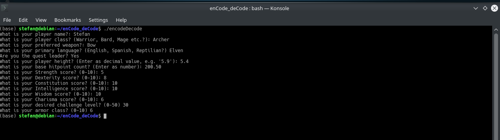
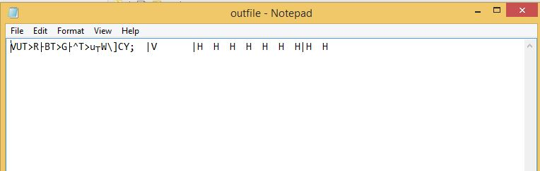
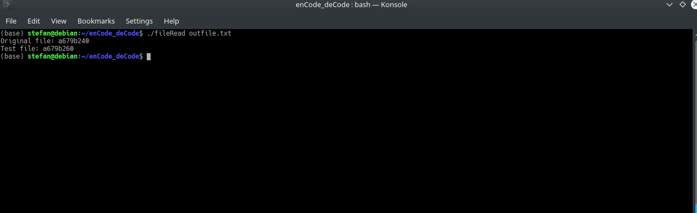
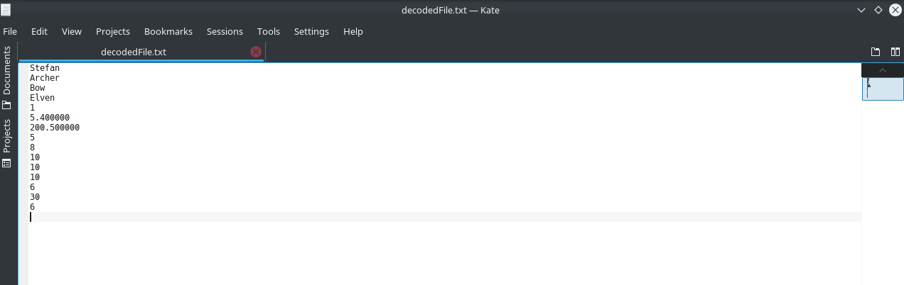

# enCode_deCode
This is a binary analysis project in C, made to encode and decode variable information based on a DnD game template, along with detecting attempts to modify this information. 

## Requirements
This project is built using the C language, and as a result requires the use of a C compiler. So please ensure that you have the GNU Compiler Collection, or another similar compiler present, and up-to-date on your machine. Since this a terminal-based program, this is the only requirement needed to compile and execute successfully. 

## Installation :rocket:
Once downloaded or cloned, `cd` into the directory that holds this project, and execute the command `make`. This compiles all source code of this project into two executable files. One will be `encodeDecode`, this is the executable that should be run first. It will allow you enter your character attributes and statistics. Once you have finished with this, a file will be created with the information you have just entered. None of this information will be readable, as it will be encrypted.  
The second executable this is produced from the makefile is `fileRead`, this should be used to detect if any changes have been made to your character's information. This is achieved with a two step process:  
**1.** The MD5 hash of the file is compared to when it was first encrypted. If anything has changed in terms of file information, this hash will also change. The user will be alerted if this is the case. 
**2.** The user variable information is decrypted, and presented to the user. If anything looks different, the user will know that their file has been compromised.

## Compilation on Windows
Once downloaded or cloned, `cd` into the directory that holds this project.  Unlike compilation in a Linux environment, `make` will not work in a Windows environment. Instead, `GCC` should be used. Usage Example: `GCC main.c interactUser.c saveFile.c -o encodeDecode.exe`. This will create executible file that can be run.  To run an executible in the terminal simply type progamName.exe. Usage example: `encodeDecode.exe`.  Due to this project being developed in a Linux environment, the second program fileRead.c is difficult to compile.  Additional libraries would be needed for compliation on windows, such as Win32 openSSL.  We recommend this program be run in a Linux environment to avoid the need to install additional libraries.  

## Usage :octocat:
<<<<<<< Updated upstream
=======
Need screenshots here of program being run.
>>>>>>> Stashed changes
### Running encodeDecode

### Encrypted information in file

### Running this file through decryption

### Examining decrypted contents

