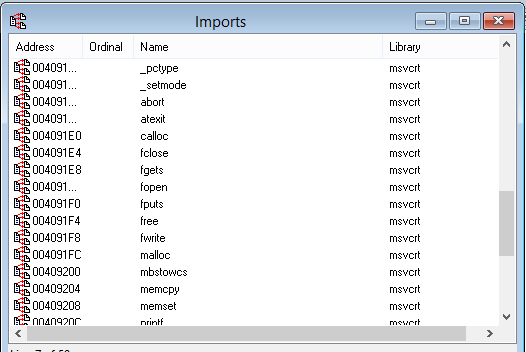
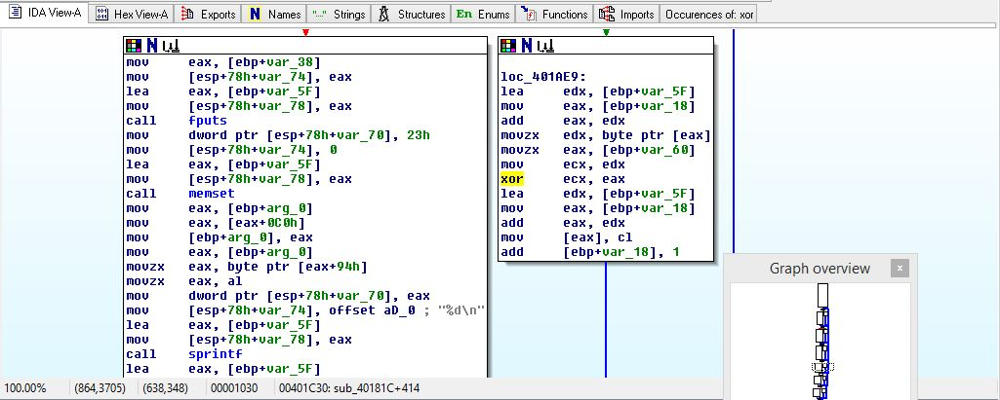

# Dissection and Analysis
Once we had collected and compiled all files we could on our Windows machine, we disassembled the main executable that performs variable encryption. Since we knew that this program wrote out to a file, we immediately looked at imports for a clue on what this executable did: 
 
So we knew that this program uses fputs to write information to a file. So, we searched for a structure that had a large number of calls to "fputs". This lead us here: 
 
Right away, we noticed a reference to an XOR command. This likely meant that this is the structure that uses XOR encryption on user variables, and then writes them to a file. This lead us to perform a search for all occurrences for an XOR command: 
[!alt text](./docs/xorOccur.jpg) 
The vast majority of these commands took place in the structure that was previously identified, and so this meant that we had found our candidate for encryption. 
Scrolling back up to the top of this structure, we found the following: 
[!alt text](./docs/outfilecapture.jpg) 
Not only does this area give the name of the file that is being written to, it also allows us to identify the hex value of our key, "2A". 2A in ASCII is "*". It was easy for us to find this because we knew what to look for. 
[!alt text](./docs/key.jpg) 
Not only this, but we could see this argument applied in the encryption process several times: 
[!alt text](./docs/argbufferb4XOR.jpg) 
With this new key information in mind, we tried to open "outfile.txt" in WinHex, to apply this new key value. However, this was unsuccessful: 
[!alt text](./docs/XORoutfilewinhex.jpg) 
This was both a win and a loss for us. We couldn't change our variables here, but it also meant that our encryption was not easily broken. We continued on to open our encryption file in Olly Debugger. We found an appropriate breakpoint in the executable that was right before any information was written to a file: 
[!alt text](./docs/ollydebug.jpg) 
We attempted to perform a binary paste with hex information from "outfile.txt" in the hex dump for the buffer that was being written to the file. Again, to no avail. Surely, if we had played around more with this binary paste, we would've been able to change something. For the purposes of testing what it would be like to TRY and spoof this software, it reinforced our belief that we had built a solid program.
